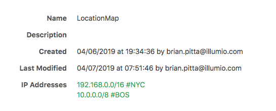

# Location Updater

## Description
CLI tool that updates the locations of Illumio workloads based off their IP addresses. The tool uses an IP List with comments as the input for labeling. An example IP list is below:



In this example, any IP address in the 192.168.0.0/24 network would have a location label of NYC and any IP Address in the 10.0.0.0/8 network would have a location label of BOS. The tool assumes the workloads have 1 NIC and only looks at the first IP address. IP Lists must be in CIDR notation, not ranges.

The tool is designed to be run on a cron job to keep location labels up-to-date.

## Binaries
Binaries for Mac, Linux, and Windows are in the `bin` folder of this repository.

## Usage
`location-updater -h`
```
Usage of location-updater:
-fqdn  string
       The fully qualified domain name of the PCE. Required.
-port  int
       The port of the PCE. (default 8443)
-user  string
       API user or email address. Required.
-pwd   string
       API key if using API user or password if using email address. Required.
-ipl   string
       IP List name to use as a reference. (default LocationMap)
-x     Disable TLS checking.
```